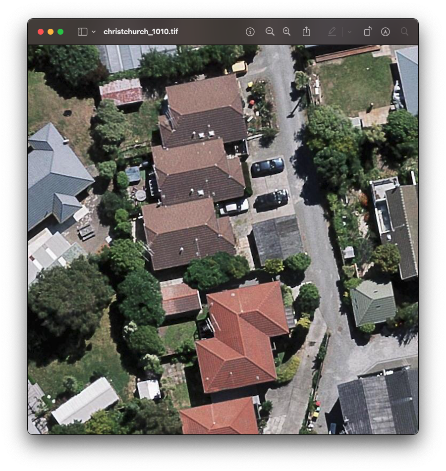

# roofAI 🏠

everything AI about roofs. 🏠

```bash
 > roofAI help
🏠 roofAI-3.4.1
🏠 everything AI about roofs.

roofAI task [<thing_1+thing_2>|all]
 . task things.
 ```

## datasets

| name | screenshot | properties | links |
|---|---|---|---|
| AIRS (Aerial Imagery for Roof Segmentation) |  | 457 km2, orthorectified, 220,000 buildings, gsd: 7.5 cm, 19.36 GB, + ground truth. | [kaggle](https://www.kaggle.com/datasets/atilol/aerialimageryforroofsegmentation), [medium](https://arash-kamangir.medium.com/roofai-1-airs-b440ebb54968) |
| 🚧 | | | |