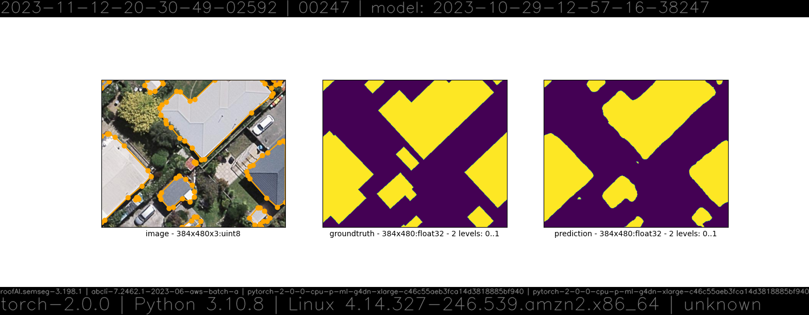

# 🏛️ roofAI

everything AI about roofs. 🏛️

🔷 [datasets](./roofAI/dataset) 🔷 [notebooks](./notebooks/) 🔷 [semseg](./roofAI/semseg) 🔷 [inference](./roofAI/inference) 🔷 [sagemaker](./roofAI/semseg/sagemaker/) 🔷



```bash
pip install roofAI
```

```bash
 > roofAI help
cloudwatch browse \
	[endpoint] \
	[<endpoint-name>]
 . browse endpoint on cloudwatch.
 * default endpoint: endpoint-model-2023-12-03-11-24-39-75649-pytorch
roofAI conda activate [sagemaker|semseg]
 . activate conda environment.
roofAI conda create [~validate,~recreate,sagemaker|semseg]
 . create conda environment.
roofAI conda environment_name [sagemaker|semseg]
 . return conda environment_name
roofAI conda validate
 . validate conda environment.
roofAI inference create \
	[dryrun,model] \
	[.|<object-name>] \
	[--verbose 1] \
	[--verify 0]
 . create inference model.
roofAI inference create \
	[dryrun,endpoint_config,suffix=<suffix>] \
	[.|<object-name>] \
	[--verbose 1] \
	[--verify 0]
 . create inference endpoint config.
roofAI inference create \
	[dryrun,endpoint,config_suffix=<suffix>,suffix=<suffix>] \
	[.|<object-name>] \
	[--verbose 1] \
	[--verify 0]
 . create inference endpoint.
roofAI inference delete \
	[dryrun,model|endpoint_config|endpoint] \
	<name> \
	[--verbose 1]
 . delete inference object.
roofAI inference describe \
	[dryrun,endpoint] \
	<name> \
	[--verbose 1]
 . describe inference endpoint.
roofAI inference invoke \
	[~download,dryrun,profile=FULL|DECENT|QUICK|DEBUG|VALIDATION,upload] \
	[-|<endpoint-name>] \
	[..|<dataset-object-name>] \
	[-|<prediction-object-name>] \
	[--verbose 1]
 . <dataset-object-name> -> inference endpoint -> <prediction-object-name>.
 * default endpoint: endpoint-model-2023-12-03-11-24-39-75649-pytorch
roofAI inference list \
	[dryrun,model|endpoint_config|endpoint,contains=<string>] \
	[--verbose 1]
 . list inference objects.
roofAI inference pull \
	[dryrun]
 . pull the inference image.
QGIS seed [screen]
 . seed 🌱 QGIS.
QGIS expressions pull
 . pull QGIS expressions.
QGIS expressions push [push]
 . push QGIS expressions.
 📂 /Users/kamangir/Library/Application Support/QGIS/QGIS3/profiles/default/python/expressions
 📂 /Users/kamangir/git/roofAI/roofAI/QGIS/expressions
QGIS serve[r] [start]
 . start QGIS server.
semseg list
 . list registered semseg models.
semseg predict \
	[device=cpu|cuda,~download,dryrun,profile=FULL|DECENT|QUICK|DEBUG|VALIDATION,upload] \
	[...|<model-object-name>] \
	[..|<dataset-object-name>] \
	[-|<prediction-object-name>]
 . semseg[<model-object-name>].predict(<dataset-object-name>) -> <prediction-object-name>.
semseg train \
	[device=cpu|cuda,~download,dryrun,profile=FULL|DECENT|QUICK|DEBUG|VALIDATION,register,suffix=<v1>,upload] \
	<dataset-object-name> \
	<model-object-name> \
	[--activation <sigmoid>] \
	[--classes <one+two+three+four>] \
	[--encoder_name <se_resnext50_32x4d>] \
	[--encoder_weights <imagenet>]
 . semseg.train(<dataset-object-name>) -> <model-object-name>.
roofAI dataset ingest \
	[source=AIRS,dryrun,open,register,suffix=<v1>,upload,target=sagemaker|torch] \
	<object-name> \
	[--test_count <10>] \
	[--train_count <10>] \
	[--val_count <10>]
 . ingest AIRS -> <object-name>.
roofAI dataset ingest \
	[source=CamVid,dryrun,open,register,suffix=<v1>,upload] \
	<object-name>
 . ingest CamVid -> <object-name>.
roofAI dataset review \
	[download,dryrun,open] \
	<object-name> \
	[--count <1>] \
	[--index <index>] \
	[--subset <subset>]
 . review <object-name>.
```

---

[](https://pypi.org/project/roofAI/)

---

To use on [AWS SageMaker](https://aws.amazon.com/sagemaker/) replace `<plugin-name>` with `roofAI` and follow [these instructions](https://github.com/kamangir/notebooks-and-scripts/blob/main/SageMaker.md).
