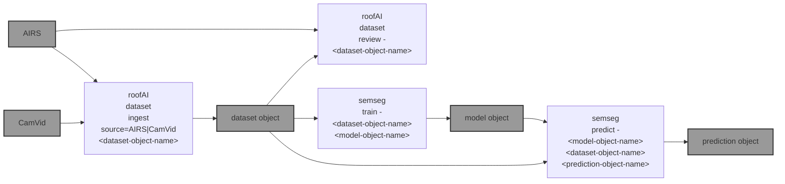

# 🏛️ roofAI

everything AI about roofs. 🏛️

```bash
pip install roofAI
```



|   |   |
| --- | --- |
| 🏛️[`datasets`](https://github.com/kamangir/roofAI/blob/main/roofAI/dataset) [](https://github.com/kamangir/roofAI/blob/main/roofAI/dataset) Semantic Segmentation Datasets | 🏛️[`semseg`](https://github.com/kamangir/roofAI/blob/main/roofAI/semseg) [](https://github.com/kamangir/roofAI/blob/main/roofAI/semseg) A Semantic Segmenter based on [segmentation_models.pytorch](<https://github.com/qubvel/segmentation_models.pytorch/blob/master/examples/cars%20segmentation%20(camvid).ipynb>). |

---


[](https://github.com/kamangir/roofAI/actions/workflows/pylint.yml) [](https://github.com/kamangir/roofAI/actions/workflows/pytest.yml) [](https://github.com/kamangir/roofAI/actions/workflows/bashtest.yml) [](https://pypi.org/project/roofAI/) [](https://pypistats.org/packages/roofAI)

built by 🌀 [`blue_options-4.189.1`](https://github.com/kamangir/awesome-bash-cli), based on 🏛️ [`roofAI-5.88.1`](https://github.com/kamangir/roofAI).
