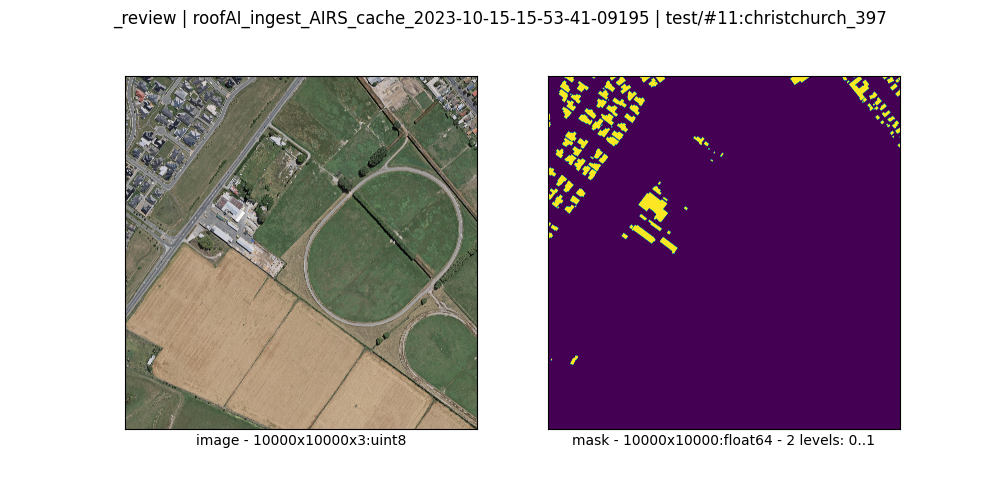
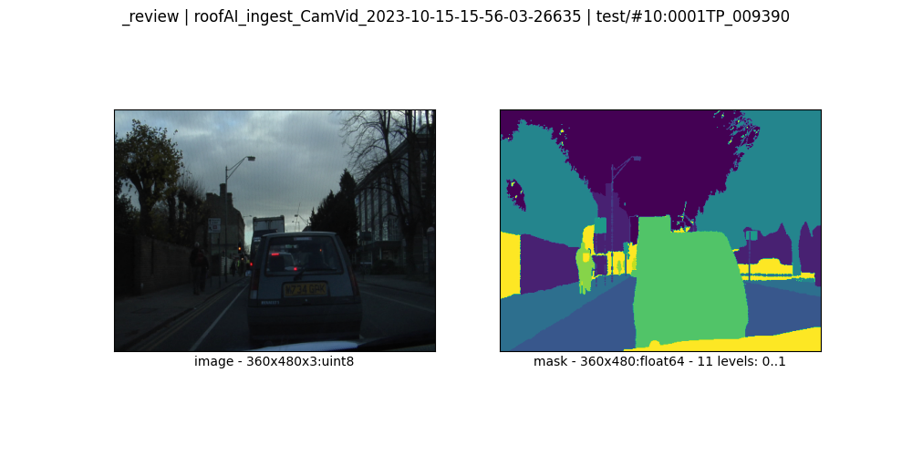

# datasets

`DatasetKind`s:

1. CamVid:
    - The [original CamVid dataset](./ingest/CamVid.md).
    - Generated by `roofAI dataset ingest`.
    - Consumed by `roofAI semseg train`.
1. AIRS: The [original AIRS dataset](./ingest/AIRS.md)
    - Should be ingested to be trained on ⬆️.
1. SageMaker: For [`sagesemseg`](https://github.com/kamangir/blue-sandbox/blob/main/blue_sandbox/sagesemseg/README.md), ingested from `AIRS` with `target=sagemaker`.

|   |   |
| --- | --- |
| [`AIRS`](./ingest/AIRS.md)  Aerial Imagery for Roof Segmentation from [kaggle](https://www.kaggle.com/datasets/atilol/aerialimageryforroofsegmentation). | [`CamVid`](./ingest/CamVid.md)  From [SegNet-Tutorial](https://github.com/alexgkendall/SegNet-Tutorial) |

