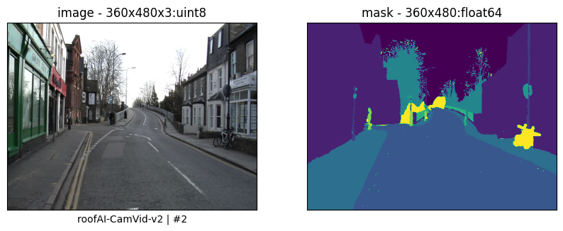
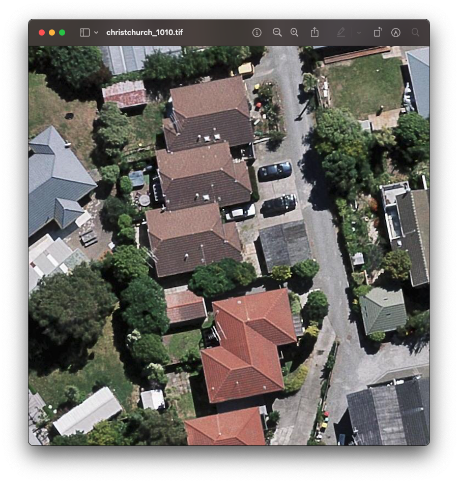

# AIRS

Aerial Imagery for Roof Segmentation, from [kaggle](https://www.kaggle.com/datasets/atilol/aerialimageryforroofsegmentation), 457 km2, orthorectified, 220,000 buildings, gsd: 7.5 cm, 19.36 GB, + ground truth.

```bash
roofAI ingest source=AIRS,register
```

- https://medium.com/@arash-kamangir/roofai-1-airs-b440ebb54968
- https://arash-kamangir.medium.com/roofai-9-ingesting-airs-2-e71dca1d28d2

[review](../../notebooks/ingest/AIRS.ipynb): for `subset` in `[test, train, val]`,

- `{subset}/image` contains `.tif`s, RGB.
- `{subset}/label` contains `.tif`s and `_vis.tif`, binary.
- `{subset}.txt`, `test.txt` missing.

# CamVid

ingested from [SegNet-Tutorial](https://github.com/alexgkendall/SegNet-Tutorial),

```bash
roofAI ingest source=CamVid,register
```

- https://arash-kamangir.medium.com/roofai-6-camvid-semseg-for-airs-1-f7530374adef
- https://arash-kamangir.medium.com/roofai-8-ingesting-airs-1f0efa4bd8a1

[review](../../notebooks/ingest/CamVid.ipynb): files are in `./SegNet-Tutorial/CamVid/`, where, for `subset` in `[test, train, val]`,

- `{subset}/` contains `.png`s: RGB. 
- `{subset}annot/` contains `.png`s: RGB, three channels identical, `0-11` corresponding to the following classes. `Dataset` filters the required `classes` for a train.
```python
CLASSES = [
    "sky",
    "building",
    "pole",
    "road",
    "pavement",
    "tree",
    "signsymbol",
    "fence",
    "car",
    "pedestrian",
    "bicyclist",
    "unlabelled",
]
```
- `{subset}.txt` is likely unused.



---

| `AIRS` | `CamVid` | | |
|---|---|---|---|
|  |  | | |