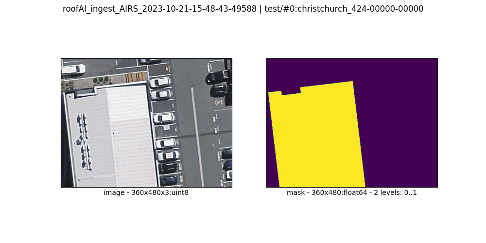
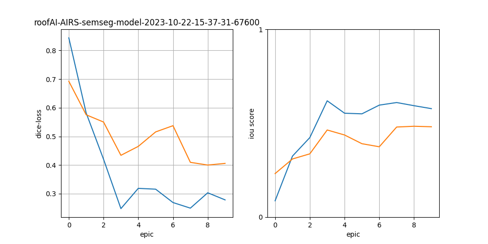
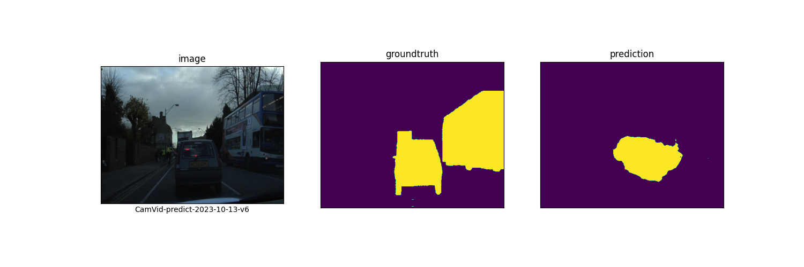

# train

```bash
roofAI semseg train \
    profile=DECENT,register,suffix=v1 \
    $(@ref roofAI_ingest_AIRS_v1) \
    $(@timestamp) \
    --classes roof
```





`model.json` (shortened)
```json
{
    "activation": "sigmoid",
    "classes": [
        "roof"
    ],
    "elapsed_time": 361.5529091358185,
    "encoder_name": "se_resnext50_32x4d",
    "encoder_weights": "imagenet",
    "epics": {
        "0": {
            "train": {
                "dice_loss": 0.8440376162528992,
                "iou_score": 0.08718136921525002
            },
            "valid": {
                "dice_loss": 0.6924602970480918,
                "iou_score": 0.23197315189281645
            }
        },
        "9": {
            "train": {
                "dice_loss": 0.2785138368606567,
                "iou_score": 0.5775847971439362
            },
            "valid": {
                "dice_loss": 0.40588687658309924,
                "iou_score": 0.4811718734062814
            }
        }
    }
}
```

# predict

```bash
roofAI semseg predict \
    profile=VALIDATION \
    $(@ref roofAI_semseg_model_AIRS_full_v1) \
    $(@ref roofAI_ingest_AIRS_v1) \
    $(@timestamp)
```



