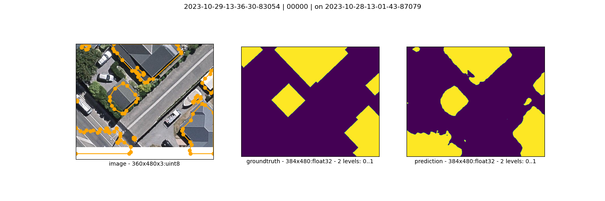

# train

```bash
roofAI semseg train \
    profile=VALIDATION \
    roofAI-CamVid-v2 \
    roofAI-CamVid-semseg-model-$(@timestamp)
```

`model.json`
```json
{
    "activation": "sigmoid",
    "classes": [
        "car"
    ],
    "encoder_name": "se_resnext50_32x4d",
    "encoder_weights": "imagenet"
}
```


https://arash-kamangir.medium.com/roofai-7-camvid-semseg-for-airs-train-51ff862fd8a6

# predict

```bash
roofAI semseg predict \
    profile=VALIDATION \
    $(@cache read latest_CamVid_model) \
    roofAI-CamVid-v2 \
    roofAI-CamVid-semseg-prediction-$(@timestamp)
```



https://arash-kamangir.medium.com/roofai-7-camvid-semseg-for-airs-2-4ad962c03b5b