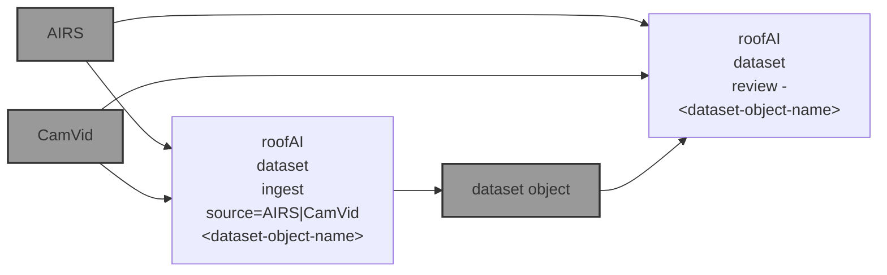

# 🏛️ roofAI

everything AI about roofs. 🏛️

```bash
pip install roofAI
```


```mermaid
graph LR
    dataset_ingest["roofAI<br>dataset<br>ingest<br>source=AIRS|CamVid<br>&lt;dataset-object-name&gt;"]

    dataset_review["roofAI<br>dataset<br>review -<br>&lt;dataset-object-name&gt;"]

    dataset_object_name["dataset object"]:::folder
    AIRS["AIRS"]:::folder
    CamVid["CamVid"]:::folder

    AIRS --> dataset_ingest
    CamVid --> dataset_ingest
    dataset_ingest --> dataset_object_name


    AIRS --> dataset_review
    CamVid --> dataset_review
    dataset_object_name --> dataset_review

    classDef folder fill:#999,stroke:#333,stroke-width:2px;
```

--table--

---

--signature--