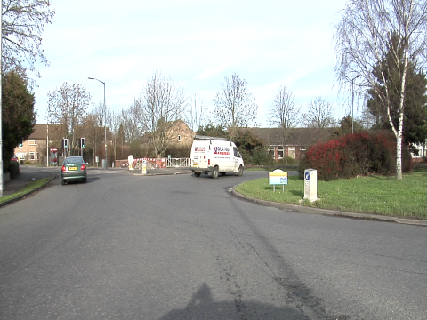

# AIRS (Aerial Imagery for Roof Segmentation)

from [kaggle](https://www.kaggle.com/datasets/atilol/aerialimageryforroofsegmentation), 457 km2, orthorectified, 220,000 buildings, gsd: 7.5 cm, 19.36 GB, + ground truth.

```bash
roofAI ingest source=AIRS,from_cache <TBA>
```

- https://medium.com/@arash-kamangir/roofai-1-airs-b440ebb54968
- url 🔥


# CamVid

ingested from [SegNet-Tutorial](https://github.com/alexgkendall/SegNet-Tutorial),

```bash
roofAI ingest source=CamVid roofAI-CamVid-v2
```

- https://arash-kamangir.medium.com/roofai-6-camvid-semseg-for-airs-1-f7530374adef

---

| `AIRS` | `CamVid` | | |
|---|---|---|---|
|  |  | | |